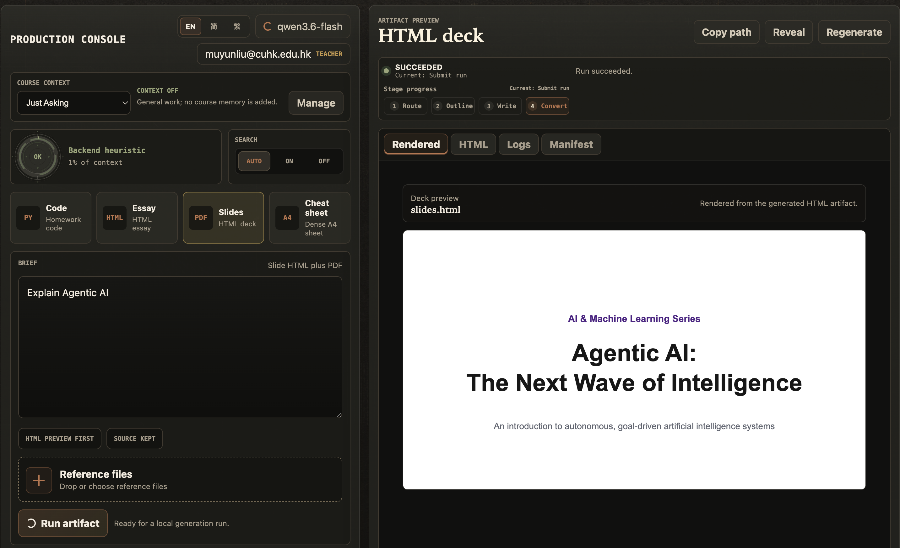

# BA3073 Take-home Individual Assignment <br> "From AI Agent to Cloud Service"

In this assignment, you will deploy the supplied AI Learning Assistant as a web service on an Aliyun ECS instance. The application uses a FastAPI backend, a browser-based user interface, SQLite storage, a Qwen-compatible model API, and Docker Compose. You will first test the service through the ECS public IP and then publish it securely through a domain name.

This is an individual assignment. Use only the supplied project files and your own cloud and model-service accounts.

## Learning outcomes

After completing this assignment, you should be able to:

- deploy a containerized web application to a cloud virtual machine;
- configure secure browser access through an SSH tunnel or a public HTTPS reverse proxy;
- manage secrets without placing them in source code;
- configure cloud firewall and security-group rules;
- persist application data outside a container;
- test and document a working cloud-hosted web service; and
- explain the security and cost implications of a public cloud deployment.

## Supplied application



AI Learning Assistant generates four types of academic artifacts:

- homework code;
- essays in HTML and PDF formats;
- presentation slides in HTML and PDF formats; and
- dense cheat sheets in HTML and PDF formats.

The web interface is served by the backend at `/ui/`. The application stores metadata in SQLite and saves generated artifacts under `workspace/`.

The supplied project is designed as learning software. Its built-in BNBU login is not production-grade authentication. For the public deployment in Task 3, you must therefore use HTTPS and an additional access-control layer at the reverse proxy.

## Task 1: Build AI Agent on local machine (40 marks)

Local deployment and verification: **20 marks**. Improving the report-generation
instructions and producing the assignment report: **20 marks**.

### Architecture

```text
AI agent source code
        ↓
Dockerfile
        ↓
docker build
        ↓
Local Docker image
        ↓
Docker container: 14242
        ↓
Local user
```

### Local Manual Launch

Start Docker Desktop and run these commands from the project folder. To build
with `--build`, your local `compose.yml` must include a `build:` section for the
backend; the supplied ACR deployment configuration requires a separately built image.

```bash
docker compose -p ai-learning-assistant up --build -d
curl -fsS http://127.0.0.1:14242/health
open http://127.0.0.1:14242/ui/
```

Wait for the backend to become healthy before running the health check. Expect
`{"status":"ok"}`. The `open` command is for macOS; on Windows or Linux, open
the same URL in your browser.

Take a **screenshot** showing the successful web interface with the browser's address bar visible.

### Record the local web-interface test

Run this Bash script in Terminal on your own computer:

```bash
bash scripts/check-local-ui.sh --open
```

The script checks `http://127.0.0.1:14242/ui/`, requests that your default browser open it, and saves the terminal output as `local-ui-check.txt` in the project folder.

### Improve the report-generation instructions (20 marks)

Revise the AI agent instructions in `backend/pipelines/essay_html.py` so the
AI Learning Assistant generates an appropriate report for this assignment.
Your instructions should guide the report's structure, clarity, technical
explanations, and use of deployment evidence.

Use the deployed AI Learning Assistant to create an assignment report of **no
more than 20 pages**. The report should explain the steps you completed, how
the deployed system works, and how it could be improved. Include screenshots
of the working interfaces from **Tasks 1 and 2**, and **Task 3's HTTPS domain
URL** and a screenshot showing the successful access-control check with the
browser's address bar visible.

Finalize the report after completing Tasks 2 and 3 so it includes evidence
from all three tasks. Include your revised instructions in the source-code
repository you submit.

## Task 2: Build AI Agent on Aliyun ECS machine (40 marks)

### Architecture

```text
AI agent source code
        ↓
Dockerfile
        ↓
docker build
        ↓
Local Docker image
        ↓
Local container test
        ↓
Alibaba Cloud ACR
        ↓
ECS pulls image
        ↓
Docker container: 14242
        ↓
Internet user
```

### Operation steps

1. Build a new image for Aliyun ECS Linux core.
2. Get free service from Alibaba Cloud Container Registry at [https://help.aliyun.com/zh/acr/](https://help.aliyun.com/zh/acr/).
3. Push your local image to Alibaba Cloud ACR.
4. Pull the image from ACR to your Aliyun ECS server.
5. Run your container on port `14242`. Then check:

   ```bash
   sudo docker ps
   ```

   You should see a port mapping like:

   ```text
   0.0.0.0:14242->14242/tcp
   ```

   For this direct-access test, use `"14242:14242"` in your ECS `compose.yml`
   instead of the supplied localhost-only port mapping.

6. Open port `14242` in the Alibaba Cloud security group for your own public IP
   address only. You should be able to visit:

   ```text
   http://<Your public IP>:14242/ui/
   ```

   **Note:** Do not share this site with public users.

   Take a **screenshot** showing the successful web interface with the browser's address bar visible.

### Record the ECS web-interface test

After starting your container, run these commands directly on your ECS server.
Enter the **ECS instance's public IPv4 address** from the Alibaba Cloud console:

```bash
read -r -p 'ECS public IPv4 address: ' ECS_PUBLIC_IP
{
  printf 'AI Learning Assistant ECS Web Interface Check\n'
  date '+Time (local): %Y-%m-%dT%H:%M:%S%z'
  date -u '+Time (UTC): %Y-%m-%dT%H:%M:%SZ'
  printf 'Machine: %s\n' "$(hostname)"
  printf 'Operating system: %s\n' "$(uname -sr)"
  printf 'CPU architecture: %s\n' "$(uname -m)"
  printf 'ECS login user: %s\n' "$(whoami)"
  printf 'Website URL: http://%s:14242/ui/\n' "$ECS_PUBLIC_IP"
  sudo docker --version
  printf '\nDocker application container:\n'
  sudo docker ps -a --filter publish=14242 --format 'table {{.ID}}\t{{.Names}}\t{{.Image}}\t{{.Status}}\t{{.Ports}}'
  printf '\nWebsite URL check from ECS:\n'
  UI_HTTP_STATUS=$(curl --noproxy '*' -sS --connect-timeout 5 --max-time 15 \
    -o /dev/null -w '%{http_code}' "http://${ECS_PUBLIC_IP}:14242/ui/")
  CURL_EXIT_CODE=$?
  printf 'HTTP status: %s\n' "$UI_HTTP_STATUS"
  if [ "$CURL_EXIT_CODE" -eq 0 ] && [ "$UI_HTTP_STATUS" = '200' ]; then
    printf 'Website URL check: PASS\n'
  else
    printf 'Website URL check: FAIL (curl exit code: %s)\n' "$CURL_EXIT_CODE"
  fi
} 2>&1 | tee ecs-docker-check.txt
```

Confirm that the output lists your running application container with port
`14242` published.

Do not include API keys, passwords, or other secrets.

## Task 3: Use a domain for public web service (20 marks)

### Architecture

```text
AI agent source code
        ↓
Dockerfile
        ↓
docker build
        ↓
Local Docker image
        ↓
Local container test
        ↓
Alibaba Cloud ACR
        ↓
ECS pulls image
        ↓
Docker container
        ↓
Nginx + Certbot
        ↓
Public IP / domain 
        ↓
Internet user
```

### Operation steps

1. Register or use a domain name or subdomain that you control; see https://help.aliyun.com/zh/dws/user-guide/how-to-register-a-domain-name.
2. Create a DNS `A` record that points the domain or subdomain to your ECS
   instance's public IPv4 address. Confirm that the record resolves correctly.
3. Allow inbound TCP ports `80` and `443` in the ECS security group so the
   domain and HTTPS service can reach Nginx. After verifying that the reverse
   proxy works, remove the public inbound rule for port `14242`.
4. Install and configure Nginx to forward requests from your domain to
   `http://127.0.0.1:14242`. First install Nginx and create a site
   configuration:

   ```bash
   sudo apt update
   sudo apt install nginx
   sudo nano /etc/nginx/sites-available/ai-agent
   ```

   Add the following server block, replacing `ai.example.com` with your
   domain or subdomain:

   ```nginx
   server {
       listen 80;
       server_name ai.example.com;

       location / {
           proxy_pass http://127.0.0.1:14242;

           proxy_set_header Host $host;
           proxy_set_header X-Real-IP $remote_addr;
           proxy_set_header X-Forwarded-For $proxy_add_x_forwarded_for;
           proxy_set_header X-Forwarded-Proto $scheme;
           proxy_read_timeout 360s;
           proxy_send_timeout 360s;
       }
   }
   ```

   Save the file, enable the site, check the Nginx configuration, and reload
   the service:

   ```bash
   sudo ln -s /etc/nginx/sites-available/ai-agent /etc/nginx/sites-enabled/ai-agent
   sudo nginx -t
   sudo systemctl reload nginx
   ```

   You can then visit the application over HTTP to confirm the domain and
   reverse proxy work. Replace `ai.example.com` with your domain:

   ```text
   http://ai.example.com/ui/
   ```

5. Once the domain works over HTTP, use Certbot with Nginx to enable HTTPS.
   Replace `ai.example.com` with your domain:

   ```bash
   sudo apt install certbot python3-certbot-nginx
   sudo certbot --nginx -d ai.example.com
   ```

   Follow Certbot's prompts to complete certificate setup. Then confirm that
   the application loads over HTTPS:

   ```text
   https://ai.example.com/ui/
   ```

   Add an access-control layer at the reverse proxy, such as HTTP Basic
   Authentication or an identity-aware access proxy. This protection must be
   separate from the application's BNBU login. Do not place passwords or other
   secrets in your report or repository. 
   
   Take a **screenshot** showing the
   successful web interface after the access-control check, with the browser's
   address bar visible.

## Submission

**Submission deadline: November 1 @ 23:59.**

Submit these items:

1. The assignment report specified in Task 1.
2. The link to your GitHub source-code repository, including the whole project.
3. `local-ui-check.txt`, generated on your local machine.
4. `ecs-docker-check.txt`, generated on your ECS server.

Do not submit secrets, application artifacts, or dependency/runtime directories,
including `.env*`, `Qwen_API`, `data/`, `workspace/`, `node_modules/`, `.venv/`,
`__pycache__/`, or `*.pyc`.

## Appendix

### Project Layout

```text
backend/            FastAPI API, SQLite storage, artifact pipelines, model provider
  api/              HTTP routes: auth, settings, uploads, runs, courses
  core/             Business logic: auth, runs, model settings, artifact access
  pipelines/        Code homework, essay, slides, cheat sheet (all HTML-native)
  providers/        OpenAI-compatible and mock model providers
  context/          Upload extraction, search policy, context budgeting
  storage/          SQLite repositories
  artifacts/        Run folder creation, manifest writer, path safety

frontend/           Vite workbench renderer
  src/              App shell, design tokens, locale catalog, styles

apps/desktop/       Electron shell (Docker detection, health polling, window)

scripts/            macOS launchers, E2E smoke, bless utility
workspace/          Generated artifact output (gitignored)
data/               SQLite database, model secrets (gitignored)
docs/               Governance files (see below)
slides_html/        Reference slide deck layout vocabulary
```

### Governance

The project uses structured governance files so any agent or contributor can
understand the system without chat history:

| File | Purpose |
| --- | --- |
| `AGENTS.md` | Entry point for AI agents: commands, project layout, and rules |
| `docs/SPEC.md` | Product intent, user workflows, and acceptance criteria |
| `docs/ARCH.md` | Architecture, module boundaries, and dependency rules |
| `docs/RULES.md` | Coding, testing, security, and review rules |
| `docs/CONTRACTS/` | Stable API, data, and UI contracts |
| `docs/DECISIONS/` | Architecture decision records (ADRs) |
| `docs/IMPLEMENTATION_SUMMARY.md` | Development completion ledger |
| `docs/QA_REPORTS/` | QA findings, fixes, and human decisions |
